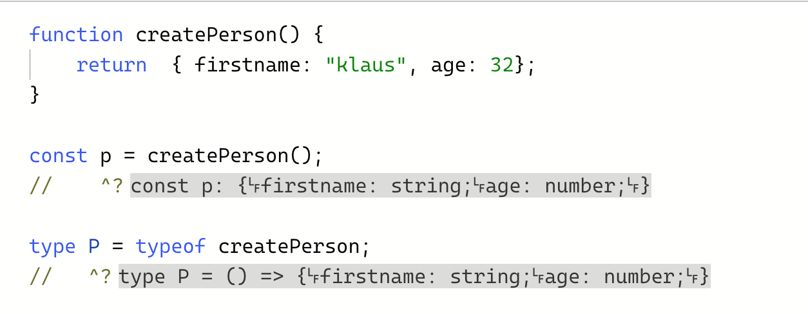

## Grundlagen

## <!-- .slide: id="t-intro" -->

### Zwei kleine Tipps

- TypeScript online im Playground ausführen: https://www.typescriptlang.org/play

---

### Zwei kleine Tipps

- Typen in der IDE/Editor anzeigen:
  - In der Regel könnt ihr Euch in Eurem Editor oder Eurer IDE den Typen einer Variable anzeigen lassen, in dem ihr mit der Maus darüber fahrt
  - Im [TypeScript Playground](https://www.typescriptlang.org/play) könnt ihr mit `// ?^` unter einer Variablen Euch deren Typen anzeigen lassen
  - 
  - Für VS Code gibt es dazu eine [Extension](https://marketplace.visualstudio.com/items?itemName=Orta.vscode-twoslash-queries)
- In IntelliJ werden die Typen teilweise anders (schlechter lesbar) angezeigt.
  - Es lohnt sich dann manchmal, zu schauen, wie etwas in VS Code aussieht

---

### Interface vs. Types

- Mit `interface` und `type` lassen sich Objekte beschreiben
- Die Syntax ist sehr ähnlich
- ```typescript
  type Person = {
    firstname: string;
    lastname: string;
  };
  ```
- ```typescript
  interface Person {
    firstname: string;
    lastname: string;
  }
  ```
- <!-- .element: class="demo" --> Gemeinsamkeiten und Austauschbarkeit
- <!-- .element: class="demo" --> Unterschiede (alias + decl. Merging)
- Unterschiede:
  - `interface`: Declaration merging
  - `type`: Aliase für beliebige Typ-Konstrukte (`interface` nur Objekte)

---

### Type Aliase

- Mit dem Schlüsselwort [`type`](https://www.typescriptlang.org/docs/handbook/2/everyday-types.html#type-aliases) wird ein **Type Alias** erzeugt.
- Ein Type Alias ist nur ein (anderer) Name für einen Typen
- Man kann immer entweder einen Type Alias oder einen kompletten Typen hinschreiben
- Beispiele:

- ```typescript
  declare function createPerson(
    firstname: string,
    address: { city: string }
  ): { firstname: string; address: { city: string } };
  ```

- ist identisch mit:
- ```typescript
  type Address = {
    city: string;
  };
  type Person = {
    firstname: string;
    address: { city: string };
  };
  declare function createPerson(firstname: string, address: Address): Person;
  ```

* ...und auch das ist identisch:
* ```typescript
  type Address = {
    city: string;
  };
  type Person = {
    firstname: string;
    address: Address;
  };
  declare function createPerson(firstname: string, address: Address): Person;
  ```

---

### Union Types

- Variablen, Parameter etc. können mehr als einen Typ annehmen:
- Man spricht dann von **Union Types**
- ```typescript
  type Person = { name: string };
  type Movie = { title: string };

  type PersonOrMovie = Person | Movie;

  declare function printNameOrTitle(p: PersonOrMovie);

  printNameOrTitle({ name: "Klaus" }); // OK

  printNameOrTitle({ title: "TypeScript Deep Dive" }); // OK

  printNameOrTitle({ label: "Save" }); // ERR
  ```

---

### Union Types

- Aus Prüfungen, die zur **Laufzeit** ausgeführt werden, kann TS Rückschlüsse auf die Typen zur **Buildzeit** ziehen.
- Das können z.B. `null`, `typeof` oder `in`-Prüfungen sein

* ```typescript
  function printNameOrTitle(obj: PersonOrMovie | null) {
    if (!obj) {
      // Type Guard
      return;
    }
    console.log(obj.title); // ERR: Property 'title' does not exist on type 'Person | Movie'

    if ("title" in obj) {
      // Abfrage ist ein "Type Guard"
      // obj ist Movie hier, title ist definiert
      console.log(obj.title);
    } else {
      // obj ist Person hier: name ist definiert
      console.log(obj.name);
    }
  }
  ```

---

### Literal Types

- Mit einem [Literal Type](https://www.typescriptlang.org/docs/handbook/2/everyday-types.html#literal-types) kannst Du einen Typen definieren, der einen konkreten String darstellt
- ```typescript
  // Beispiel:
  type Answer = "Yes" | "No" | "I_dont_care";

  const a1: Answer = "Yes"; // OK
  const a2: View = "Maybe"; // FEHLER
  ```

- ```typescript
  function fillIn(a: Answer) {
    if (a === "Yes") { ... } // ok
    if (a === "Maybe") { ... } // error: immer false
  }

  fillIn("I_dont_care"); //OK
  fillIn("Maybe"); // ERROR
  ```

- Das funktioniert auch für number
- ```typescript
  type OneOrZero = 1 | 0;
  declare function toggleBit(v: OneOrZero): void;
  toggleBit(1); // OK
  toggleBit(2); // ERR
  ```

---

### Der typeof-Operator

- Der `typeof`-Operator in JavaScript liefert den _Wert_ einer Variablen zur Laufzeit zurück.
- Mit dem [`typeof`-Operator von TypeScript](https://www.typescriptlang.org/docs/handbook/2/typeof-types.html#handbook-content) kann der Typ eines Werts auf Typ-Ebene ermittelt werden.
  - Im Grunde das, was die IDE tut, wenn ihr mit der Maus über einen Variable fahrt
- ```typescript
  const languages = {
    de: "DE",
    en: "EN",
  };

  type TLanguages = typeof languages; // TLanguages ist TYPE, languages ist WERT
  // { de: string; en: string; }

  export declare function translateMessage(
    msg: string,
    lang: keyof TLanguages
  ): string;

  // oder:
  type TLanguageKeys = keyof typeof languages;
  export declare function translateMessage(
    msg: string,
    lang: TLanguageKeys
  ): string;
  ```

- Das geht für alle möglichen Dinge, auch für Funktionen:
- ```typescript
  declare function sayHello(name: string): string | null;

  type Fn = typeof sayHello;
  // (name: string) => string | null
  ```

---

### Index Access

- Mit dem Index Operator kannst Du in JavaScript auf _Werte_ aus einem _Objekt_ zugreifen:
- ```typescript
  const person = {
    firstname: "Klaus",
    address: { city: "Hamburg", street: "Reeperbahn" },
  };

  const address = person["address"];
  ```

- Etwas ähnliches kannst Du auch mit _Typen_ machen, wenn du den _Typ_ eines Properties benötigst:
- ```typescript
  type Person = {
    firstname: string;
    address: { city: string };
  };

  type Address = Person["address"];
  ```

- Das kann hilfreich sein, wenn Du einen Typen hast, den Du nicht selbst beschrieben hast.
  - Zum Beispiel wenn der Typ aus einer Bibliothek stammt oder von einem Code Generator erzeugt wurde.

---

### Index Access #2

- Wenn Du den Typen eines Arrays benötigst, kannst Du statt eines Property-Namens `[number]` hinschreiben:
- ```typescript
  type Person = {
    contacts: [
      {
        email: string;
        phone: string;
      }
    ];
  };

  type Contacts = Person["contacts"]; // Array<{ email: string, phone: string }>
  type Contact = Person["contacts"][number]; //       { email: string, phone: string }

  declare function addContact(c: Contact): void;

  addContact({ email: "nils@nilshartmann.net", phone: "..." });
  ```

---

### keyof

- [`keyof`](https://www.typescriptlang.org/docs/handbook/2/keyof-types.html) liefert einen Union Typen zurück, der alle Keys eines Objektes enthält
- ```typescript
  type Person = {
    firstname: string;
    lastname: string;
  };
  type PersonKeys = keyof Person; // "firstname" | "lastname"
  ```

- Damit kann man zum Beispiel erzwingen, das ein Funktionsparameter nur gültige
  Keys eines Objekts aufnehmen kann:
- ```typescript
  declare function logPropertyOfPerson(propName: keyof Person): void;

  logPropertyOfPerson("firstname"); // OK
  logPropertyOfPerson("age"); // ERR: Argument of type '"age"' is not
  // assignable to parameter of type 'keyof Person'
  ```

---

## Generics

<!-- .slide: id="t-generics" -->

---

### Generics

- **Beispiel**: eine (JavaScript-)Funktion, die einen beliebigen Wert validiert. Wenn der Wert gültig ist,
  wird er von der Funktion unverändert zurückgegeben, ansonsten wirft die Funktion einen `Error` und kehrt nicht zurück.
- Mit `any` können wir Funktionen beschreiben, die alle möglichen Typen entgegennehmen
  und/oder zurückliefern
  - ```typescript
    declare function validate(obj: any): any;
    ```
- Was machen wir aber, wenn wir den übergebenen Typen (für `obj`) an anderer Stelle benötigen?
  - Zum Beispiel, um sicherzustellen, dass der Rückgabe-Typ dem Typen eines Parameters entspricht?
- ```typescript
  const p = validate("hallo"); // p soll string sein (ist: any 😔)
  const n = validate(123); // n soll number sein (ist: any 😔)
  ```

---

### Generics

- Für Funktionen (und Typen) können **Typ Variablen** definiert werden
- Fast wie Funktionsparameter, nur dass keine **Werte**, sondern **Typen** angegeben werden
- Die Typ Variable wird deklariert (`<VariablenName>`) und kann dann in der gesamten Funktionssignatur bzw. Typ-Definition verwendet werden
- Vorheriges Beispiel, jetzt mit Generics und gewünschtem Verhalten:

  - ```typescript
    // "O" ist Typ Variable

    declare function validate<O>(o: O): O;
    const p = validate("hallo"); // p jetzt string 😊
    const n = validate(123); // n jetzt number 😊
    ```

- Weitere Beispiele
  - Fachliche Idee: Die Funktion liefert den übergebenen Wert zurück
    oder "null", falls der Wert ungültig ist (was auch immer "ungültig" hier bedeutet)
  - ```typescript
    declare function validate<O>(o: O): O | null;
    ```
  - Ein Typ, der entweder eine Liste von Dingen ist oder `null`
    - (fachlich bescheuertes Beispiel, bessere Beispiele folgen...)
  - ```typescript
    type ListOrNull<O> = Array<O> | null;
    ```

---

### Generics

- Beim Verwenden in einer Funktion wird der **Typ** entweder vom übergebenen **Wert** abgeleitet:
- ```typescript
  declare function validate<O>(o: O): O | null;
  const x = validate("Hallo"); // O ist string, x ist string | null
  const y = validate(7); // O ist number, y ist number | null
  ```
- ...oder der Typ wird explizit angegeben. Dann muss der **Wert** dem angegebenen **Typen** entsprechen:
- ```typescript
  validate<string>("Hallo"); // O ist string, Argument ist string: Alles OK!
  validate<string>(7); // O ist string, Argument ist number:
  // ERR: Argument of type 'number' is not assignable to parameter of type 'string'
  ```

---

### Generics: Default-Werte

- Analog zu "normalen" Funktionsargumenten, können auch bei Generics Default**typen** angegeben werden
- Wie bei Funktionsargumenten kann auch nur der letzte bzw. die letzten Argumente Default-Typen haben
- ```typescript
  declare function validate<O, R = string>(o: O): O | R;

  validate(7); // RückgabeTyp: number | string
  validate<number>(7); // RückgabeTyp: number | string
  validate<number, null>(7); // RückgabeTyp: number | null
  validate<number, boolean>(7); // RückgabeTyp: number | boolean
  ```

- ```typescript
  type Tuple<X, Y = string> = [X, Y];

  type TupleOfNumberAndStrings = Tuple<number>; // [number, string]
  type TupleOfStringAndBoolean = Tuple<string, boolean>; // [string, boolean]
  ```

- Wie bei Funktionsargumenten, können auch Typ Variablen an andere Typen weitergegeben werden:
- ```typescript
  type ReactUseStateTuple<V> = Tuple<V, (newValue: V) => void>;
  // [ V, function(a: V): void ]
  ```

---

### Generic: Constraints

- Wie bei "normalen" Argumente, können die Typ-Argumente Einschränkungen haben:
- Die Einschränkungen werden mnit `extends` definiert
  - Der übergenene Typ muss dann derselbe oder ein davon erweiterter sein:
- Beispiel: beliebiges Objekt erlaubt
- ```typescript
  declare function validateObject<O extends object>(o: O): O | null;

  validateObject({ name: "Klaus" }); // OK
  validateObject("Klaus"); // ERR: Argument of type 'string' is not
  // assignable to parameter of type 'object'
  ```

- Beispiel: nur Objekte mit bestimmter Struktur erlaubt
- ```typescript
  type Person = { firstname: string | null };

  declare function getOrDefault<P extends Person>(p: P): P;

  getOrDefault({}); // ERR: Property 'firstname' is missing in type '{}'
  // but required in type 'Person'
  ```

---

### Generics mit Union Typen

- Wenn man einen Union Type als Constraint angibt, muss der übergebene Typ einem
  der im Union-Typen enthaltenen Typen entsprechen:
- ```typescript
  type Color = "red" | "blue" | "green";

  declare function bgColor<C extends Color>(c: Color): { backgroundColor: C };

  bgColor("red"); // OK
  bgColor("white"); // Argument of type '"white"' is not
  // assignable to parameter of type 'Color'
  ```

- ```typescript
  type ListOfStringsOrBooleans<X extends string | boolean> = Array<X>;

  const c1: ListOfStringsOrBooleans<string> = ["a"]; // Ok
  const c2: ListOfStringsOrBooleans<boolean> = [true]; // Ok
  const c3: ListOfStringsOrBooleans<string | boolean> = [true, "jo!"]; // Ok

  const c4: ListOfStringsOrBooleans<number> = [4]; // ERR Type 'number' does not satisfy
  // the constraint 'string | boolean'

  declare function validateNumberOrString<O extends string | number>(
    o: O
  ): O | null;
  ```

---

### Mapped Types

- Mit einem [Mapped Type](https://www.typescriptlang.org/docs/handbook/2/mapped-types.html) kannst Du aus einem bestehenden TypeScript Typen einen anderen erzeugen.
- Du kannst damit Logik, die in JavaScript auf Werte-Ebene funktioniert auf Typ-Ebene nachbauen
- Dazu ein Beispiel: eine Funktion, die jedes Feld eines Objekts validiert und ein neues Objekt mit dem Validierungsergebnis zurückliefert:
- ```javascript
  function validateField(value) {
    // Validierungslogik...
    return true; // oder false
  }

  function validateObject(object) {
    if (object == null || typeof object !== "object") {
      throw new Error("invalid type");
    }
    const result = {};
    Object.keys(object).forEach((k) => {
      result[k] = validateField(object[k]);
    });
    return result;
  }
  ```

- Die Funktion nimmt ein beliebiges Objekt entgegen und liefert ein neues Objekt zurück:
  - in diesem sind dieselben Keys wie im Ausgangsobjekt vorhanden
  - Die Werte sind aber in diesem Fall jeweils `true` oder `false` (je nachdem, was die fiktive
    `validateField`-Funktion zurückgegeben hat.)

---

### Mapped Types

- Eine - unzureichende - Typ-Definition für diese Funktion könnte so aussehen:
- ```typescript
  declare function validateObject(o: object): object;

  const result = validateObject({ firstname: "Klaus", age: 32 });
  //  ^? result: object
  ```

- So käme ein _beliebiges_ oder _allgemeines_ Objekt zurück. Wir wissen aber eigentlich genauer, wie das Objekt aussieht, das zurückgeliefert wird.
- ```typescript
  const result = validateObject({ firstname: "Klaus", age: 32 });
  //  präziser Rückgabetype wäre: { firstname: boolean, age: boolean }
  ```

- Mit einem Mapped Type können wir diese Regel auf Typ-Ebene dynamisch umsetzen, und so diesen präzisen Rückgabe-Typ erzeugen.

---

### Mapped Types

- Um den Rückgabe-Typ von `validateObject` zu beschreiben, können wir einen eigenen Typen definieren (`ValidatedObject`)
- Der `ValidatePerson`-Typ kann generisch beschrieben werden, so dass er _automatisch_ alle Properties
  aus einem Typen enthält, deren Typ aber nun jeweils `boolean` ist. Für den konkreten Typen `Person` sähe das so aus:

  - ```typescript
    type Person = { firstname: string; age: number };
    type ValidatedObject = {
      [Key in keyof Person]: boolean;
    };

    // ^?  { firstname: boolean; age: boolean }
    ```

- Den Ausdruck `keyof Person` kennen wir schon: hier wird ein Union Typ zurückgeliefert, der aus allen Keys des Objekts besteht
- Mit `[Key in keyof Person]` wird an dieser Stelle über alle Keys in dem Objekt "iteriert" und der Typ des jeweiligen Keys in die Typ Variable `Key` geschrieben
  - im Beispiel der `Person` wäre das also: `firstname` und dann `age`
  - `Key` ist ein Variablenname, den ihr frei vergeben könnt.
- Auf der rechten Seite vom Doppelpunkt steht (wie gewohnt) der Typ für das jeweilige Property (hier also: `boolean`)

---

### Mapped Types

- Natürlich können wir alle möglichen Veränderungen im Ziel-Objekt vorgenommen werden, z.B. auch `readonly` hinzugefügt, oder Felder optional gemacht werden:

  - ```typescript
    type ValidatedPerson = {
      readonly [Key in keyof Person]?: boolean;
    };

    //  ^?  { readonly firstname?: boolean, readonly age?: boolean }
    ```

- Es gibt bereits fertige [Utility Types](https://www.typescriptlang.org/docs/handbook/utility-types.html) für eine Vielzahl typischer Anwendungsfälle,
  z.B. [Partial](https://www.typescriptlang.org/docs/handbook/utility-types.html#partialtype), [Required](https://www.typescriptlang.org/docs/handbook/utility-types.html#requiredtype) oder [Readonly](https://www.typescriptlang.org/docs/handbook/utility-types.html#readonlytype)

---

### Mapped Types #2

- Im vorherigen Beispiel haben wir allen Einträgen eines Objekts einen fixen neuen Typen (`boolean`) zu gewiesen.
- Es gibt aber auch Fälle, in denen der Typ eines Eintrags aus dem Typen des Originals abgeleitet werden soll.
- In einer modifizierten Variante der `validate`-Funktion, liefert diese nun nicht mehr `boolean` zurück, sondern den Original-Wert eines Feldes oder `null`, falls dieser ungültig ist:
- ```javascript
  function validateField(value) {
    // Validierungslogik...
    return value; // oder null falls ungültig
  }

  function validateObject(object) {
    // unverändert...
  }
  ```

- Wenn wir ein Objekt des `Person`-Typen validieren lassen, müsste der Rückgabe-Typ folglich so aussehen:
- ```typescript
  const result = validateObject({ firstname: "Klaus", age: 32 });
  // ^?  { firstname: string | null, age: number | null }
  ```

---

### Mapped Types #2

- Über den Index Access können wir beim Erzeugen des neuen Typen auf die ursprünglichen Typen der Properties des Original-Typen zugreifen
- Damit können wir zum Beispiel einen Typen bauen, der alle Properties aus dem ursprünglichen Typen hat, diese sind aber im neuen Typen nullable:
- ```typescript
  type Person = {
    firstname: string;
    age: number;
  };

  type ValidatedObject = {
    [Key in keyof Person]: Person[Key] | null;
  };
  // ^? { firstname: string | null, age: number | null }

  declare function validate(p: Person): ValidatedObject;
  ```

---

### Mapped Types mit Generics

- Unsere `validate`-Funktion soll eigentlich _beliebige_ Objekte validieren und nicht nur `Person`-Objekte.
- Daher muss unser `ValidatedObject`-Typ _generisch_ sein und eine Typ-Variable verwenden
- Die Typ-Variable gibt den zu transformierenden Typen an (z.B. `Person`)
- Damit kannst Du _beliebige_ Typen in andere Typen transformieren:
- ```typescript
  type ValidatedObject<OBJECT extends object> = {
    [Key in keyof OBJECT]: OBJECT[Key] | null;
  };

  type ValidatedContact = ValidatedObject<{ phone: string; mobile: boolean }>;
  // ^? { phone: string | null, mobile: boolean | null }
  ```

- Wie muss die Signatur von der `validate`-Funktion jetzt aussehen? 🤔
- ```typescript
  declare function validate<O extends object>(o: O): ValidatedObject<O>;

  const person = { firstname: "Klaus", age: 123 };
  const result = validate(person);
  // ^? { firstname: string | null, age: number | null }
  ```

---

### Exkurs: "Flattening von Typen"

- Beim Bauen von Typen, z.B. durch Intersections, wird die Darstellung des erzeugen Typen ab und an "unübersichtlich":

- ```typescript
  interface A {
    firstname: string;
  }

  type B = A & {
    lastname: string;
  };

  // ^? type B = A & { lastname: string }

  // schöner wäre: type B = { firstname: string, lastname: string}
  ```

- Es gibt mehrere "Tricks", wie man dieses Verhalten erzeugen kann. Für mich funktionier am besten dieser Utility Typ:
- ```typescript
  type Flatten<O, T extends keyof O = keyof O> = {
    [P in T]: O[P];
  };
  ```
- ```typescript
  type Flatten_B = Flatten<B>;
  //          ?^  type Flatten_B = { firstname: string, lastname: string}
  ```
- oder, selbes Ergebnis, direkt beim Erzeugen des Typen verwenden:
  ```typescript
  type B = Flatten<A & { lastname: string }>;
  ```
